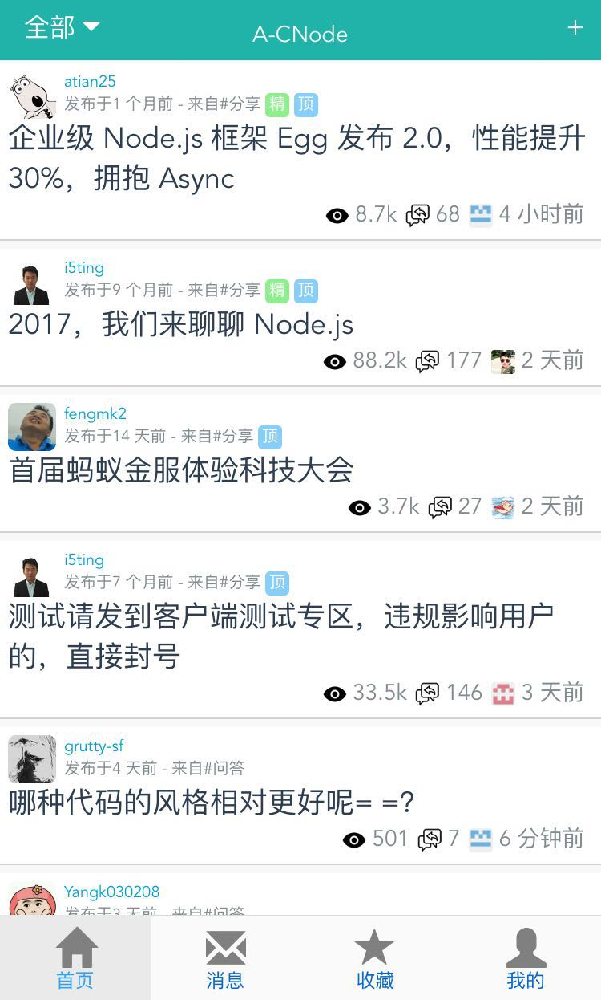

# a-cnode

> A CNode forum client.  

## Features
- [x] Retrieve latest topic, pull/push to refresh/loadmore
- [x] Login, remember login state
- [x] View/manage collected topics
- [x] View topic content, reply topic, quote reply
- [x] Message notifiction, view message details
- [x] View user details
- [ ] Edit topic content

## Technology Stack
Vue + Vuex + Vue-router + Webpack + Mint-ui

## Data source
Provided by [CNode Api](https://cnodejs.org/api).

## License
[MIT](https://github.com/samcsf/a-cnode/blob/master/LICENSE)
